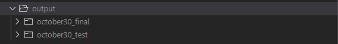
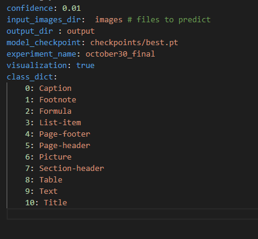

# Prediction Guide

This guide outlines the steps for configuring and running predictions in this project.

## Output Structure

After running the prediction script, the output will follow this structure:


## Configuring Parameters

To configure the prediction settings, update the relevant fields in `configs.yaml` located in the `predict` directory. Here is an example of the fields to be updated:


## Running Predictions

Once the configuration is complete, you can generate predictions by running the following command:

```bash
python -m predict.demo
